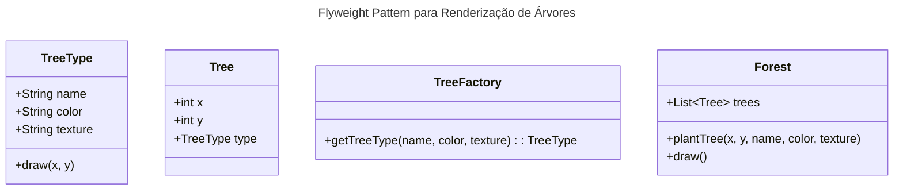

# Padrão estrutural Flyweight

## Intenção
O padrão Flyweight tem como objetivo reduzir o consumo de memória em aplicações que precisam manipular uma grande quantidade de objetos semelhantes. Ele alcança isso compartilhando os dados comuns (estado intrínseco) entre objetos que, de outra forma, teriam dados redundantes.

## Motivação
Em cenários como a renderização de milhões de árvores em uma tela, cada árvore possui propriedades comuns (como nome, cor e textura) que podem ser compartilhadas. Sem o Flyweight, cada instância de árvore armazenaria suas próprias cópias desses atributos, consumindo muita memória. Ao aplicar o Flyweight, essas propriedades são armazenadas uma única vez e compartilhadas entre todas as árvores que apresentam as mesmas características, enquanto os dados únicos (como a posição no plano) são mantidos separadamente. Essa estratégia reduz significativamente o uso de memória e melhora a performance em aplicações gráficas e de simulação.

## Aplicabilidade
Use o padrão Flyweight quando:
- Você precisa criar um grande número de objetos que possuem propriedades comuns.
- O custo de armazenamento dos dados duplicados é elevado.
- A aplicação pode separar claramente o estado intrínseco (compartilhável) do estado extrínseco (variável por objeto).

## Estrutura
A seguir, um diagrama UML que ilustra a estrutura do Flyweight aplicada ao exemplo de renderização de árvores:



## Participantes
1. **TreeType**  
   *Interface ou classe abstrata que define os membros dos objetos compartilháveis.*  
   No exemplo, a classe **TreeType** representa o estado intrínseco das árvores (nome, cor e textura) que pode ser compartilhado entre diversas instâncias.

2. **Tree**  
   *Contém o estado extrínseco que não pode ser compartilhado.*  
   A classe **Tree** armazena a posição (x, y) de cada árvore, que é única para cada instância e, portanto, não pode ser compartilhada.

3. **TreeFactory**  
   *Cria e gerencia os objetos Flyweight, garantindo que os mesmos sejam reutilizados quando possível.*  
   A classe **TreeFactory** é responsável por criar e retornar instâncias de **TreeType**. Se um tipo de árvore com os mesmos atributos já existir, ele reutiliza a instância existente em vez de criar uma nova.

4. **Forest**  
   *Gerencia a coleção de objetos Tree e atua como cliente do padrão Flyweight.*
   A classe **Forest** é responsável por manter e gerenciar a coleção de árvores que compõem a floresta. Ela utiliza a **TreeFactory** para plantar novas árvores, garantindo que os objetos **TreeType** compartilháveis sejam reutilizados sempre que possível, e delega o desenho das árvores para os respectivos objetos **Tree**. Dessa forma, a **Forest** integra e centraliza a aplicação do padrão Flyweight no contexto da renderização da floresta.

## Exemplo de Código
O exemplo abaixo demonstra como o padrão Flyweight pode ser implementado para renderizar uma floresta com milhões de árvores, compartilhando as características comuns entre elas:

```java
import java.util.ArrayList;
import java.util.HashMap;
import java.util.List;
import java.util.Map;

// Classe que representa o estado intrínseco compartilhado (Flyweight)
public class TreeType {
    private String name;
    private String color;
    private String texture;

    public TreeType(String name, String color, String texture) {
        this.name = name;
        this.color = color;
        this.texture = texture;
    }

    // Método para desenhar a árvore na posição especificada
    public void draw(int x, int y) {
        System.out.println("Desenhando uma " + name +
                           " na posição (" + x + ", " + y + ") com cor " +
                           color + " e textura " + texture + ".");
    }
}

// FlyweightFactory que gerencia e compartilha os objetos TreeType
public class TreeFactory {
    private Map<String, TreeType> treeTypes = new HashMap<>();

    // Retorna uma instância de TreeType. Se não existir, cria uma nova.
    public TreeType getTreeType(String name, String color, String texture) {
        String key = name + "_" + color + "_" + texture;
        if (!treeTypes.containsKey(key)) {
            treeTypes.put(key, new TreeType(name, color, texture));
        }
        return treeTypes.get(key);
    }
}

// Classe que representa o estado extrínseco da árvore (não compartilhado)
public class Tree {
    private int x;
    private int y;
    private TreeType treeType;

    public Tree(int x, int y, TreeType treeType) {
        this.x = x;
        this.y = y;
        this.treeType = treeType;
    }

    // Chama o método draw do TreeType para desenhar a árvore na posição correta
    public void draw() {
        treeType.draw(x, y);
    }
}

// Classe que gerencia um conjunto de árvores (Floresta)
public class Forest {
    private List<Tree> trees = new ArrayList<>();
    private TreeFactory treeFactory = new TreeFactory();

    // Planta uma árvore criando ou reutilizando um TreeType compartilhado
    public void plantTree(int x, int y, String name, String color, String texture) {
        TreeType type = treeFactory.getTreeType(name, color, texture);
        Tree tree = new Tree(x, y, type);
        trees.add(tree);
    }

    // Desenha todas as árvores da floresta
    public void draw() {
        for (Tree tree : trees) {
            tree.draw();
        }
    }
}

// Exemplo de uso
public class FlyweightExample {
    public static void main(String[] args) {
        Forest forest = new Forest();
        forest.plantTree(10, 20, "Carvalho", "Verde", "Rugosa");
        forest.plantTree(15, 25, "Carvalho", "Verde", "Rugosa");
        forest.plantTree(30, 40, "Pinheiro", "Verde", "Lisa");

        // Desenha a floresta, reutilizando os objetos TreeType compartilhados
        forest.draw();
    }
}
```

**Explicação do Código:**  
- **TreeType** guarda as informações comuns a várias árvores.  
- **TreeFactory** garante que para cada combinação de atributos (nome, cor, textura) seja criada apenas uma instância de **TreeType**.  
- **Tree** representa uma árvore individual com sua posição (estado extrínseco) e uma referência ao seu **TreeType**.  
- **Forest** gerencia todas as árvores, permitindo a plantação e o desenho, beneficiando-se do compartilhamento proporcionado pelo Flyweight.

## Consequências
### Vantagens
- **Redução do uso de memória:** Ao compartilhar o estado intrínseco, o padrão evita a duplicação de dados em objetos semelhantes.  
- **Melhoria na performance:** Em cenários com muitos objetos, a redução do consumo de memória pode levar a uma execução mais eficiente e menos gargalos de performance.

### Desvantagens
- **Complexidade:** A separação entre estado intrínseco e extrínseco pode aumentar a complexidade do código.  
- **Gerenciamento adicional:** A implementação de uma fábrica (Factory) para gerenciar os objetos compartilhados exige cuidados para evitar erros, como a criação inadvertida de objetos duplicados.
